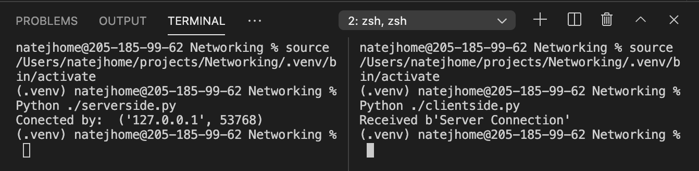

##Client side to server side computing

This set of programs does a simple TCP interaction between a client side connector and a server side reciever. The program simply connects to the server, and confirms that they have been connected by printing confirmation messages.

This small project uses the already integrated socket libraries of python, and has a fairly simple structure to its connections. The server is first initialized, searching for clients to connect to it, the client side program is then run and connects to the searching server. When the connection is made, each side displays a message notifying the user that the connection is complete. The server side displays the socket number and the IP address (just the local host in this case) and the client is notified that their connection was recieved.

Albeit a simple intereaction, this shows the connection between a local user based server and client connection from one device. 

